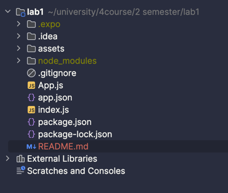
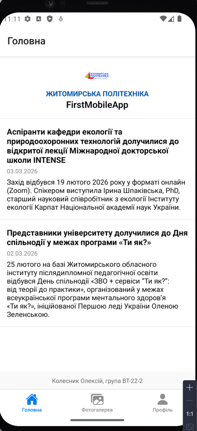
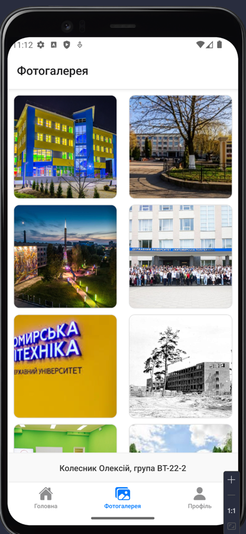
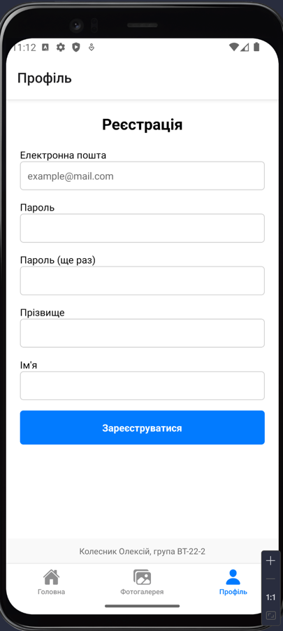

# Лабораторна робота №1: Створення додатка на React Native через Expo

**Виконав:** Колесник Олексій  
**Група:** ВТ-22-2  


## 1. Тема та мета роботи
**Тема:** Використання Expo для створення найпростішого додатка React Native. Знайомство з основними компонентами.  
**Мета:** Навчитися створювати та налаштовувати проєкт у середовищі Expo, ознайомитися зі структурою React Native застосунку та опанувати навички роботи з базовими компонентами.

## 2. Опис проєкту
Додаток реалізовано на базі фреймворку React Native з використанням Expo SDK. Навігація побудована за допомогою `@react-navigation/bottom-tabs`.

### Структура додатка:
* **Екран «Головна»**: Містить логотип університету, назву додатка та список новин (використано `FlatList`).
* **Екран «Фотогалерея»**: Відображає сітку зображень (2 колонки), які завантажуються локально з папки `assets`.
* **Екран «Профіль»**: Форма реєстрації користувача з текстовими полями введення (`TextInput`) та кнопкою.

> На кожному екрані внизу додано ідентифікатор автора: **Колесник Олексій, група ВТ-22-2**.

## 3. Інструкція із запуску
Для запуску проєкту на MacBook необхідно виконати наступні команди в терміналі:

1.  **Клонування репозиторію:**
    ```bash
    git clone [https://github.com/ВашЛогін/MobileLabsRN2026.git](https://github.com/ВашЛогін/MobileLabsRN2026.git)
    cd MobileLabsRN2026/lab1
    ```
2.  **Встановлення залежностей:**
    ```bash
    npm install
    ```
3.  **Запуск через Expo:**
    ```bash
    npx expo start --tunnel
    ```
4.  **Вибір пристрою:**
    * Натисніть `a` для запуску в Android Studio Emulator.
    * Натисніть `i` для запуску в iOS Simulator.
    * Відскануйте QR-код через **Expo Go** для запуску на фізичному телефоні.

## 4. Порівняння способів запуску
Під час виконання роботи було протестовано два методи запуску:

1.  **Емулятор (Android Studio)**:
    * *Переваги*: Швидке оновлення коду (Hot Reload), зручно відстежувати логи в терміналі, не потребує наявності кабелів чи зарядки смартфона.
    * *Недоліки*: Потребує багато оперативної пам'яті комп'ютера.

2.  **Фізичний пристрій (Expo Go)**:
    * *Переваги*: Можливість протестувати реальну швидкість роботи, відгук інтерфейсу на дотики та роботу сенсорів.
    * *Недоліки*: Потребує стабільного інтернет-з'єднання в тій самій мережі, що й ноутбук.

## 5. Результати роботи (Скріншоти)

### Встановлення проекту


### Головна сторінка


### Фотогалерея


### Профіль (Реєстрація)


## 6. Висновки
Під час виконання лабораторної роботи я навчився розгортати React Native проєкти за допомогою Expo, працювати з базовими компонентами та створювати навігацію між екранами. Було вивчено особливості стилізації компонентів у мобільному середовищі порівняно з веброзробкою.