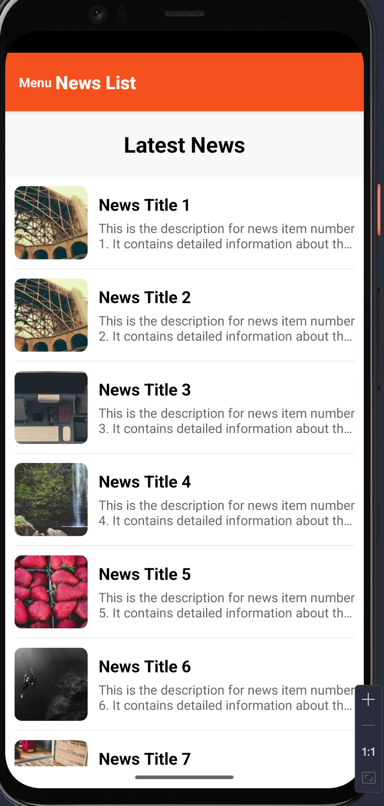
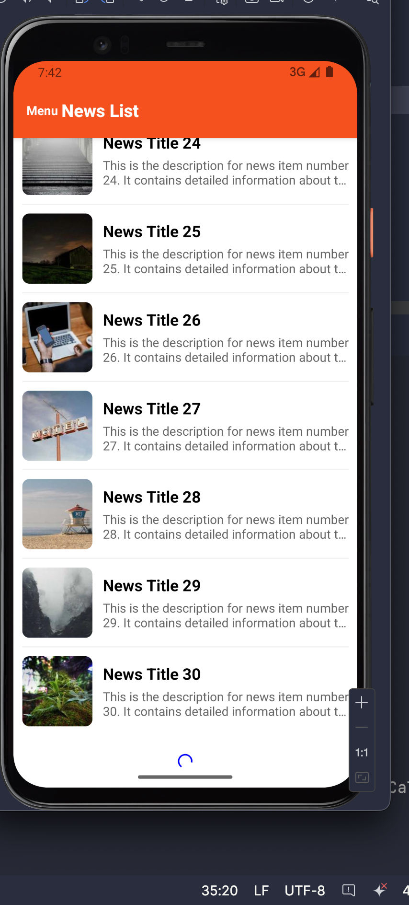
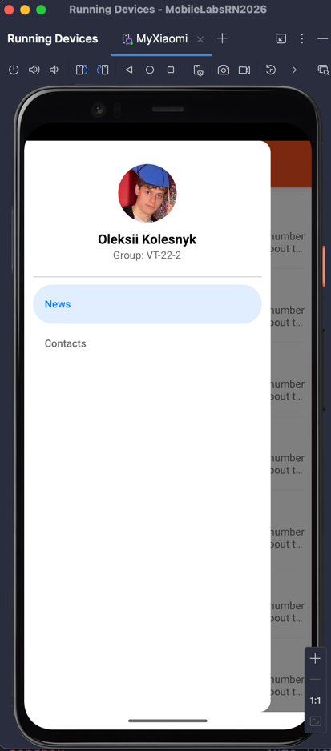
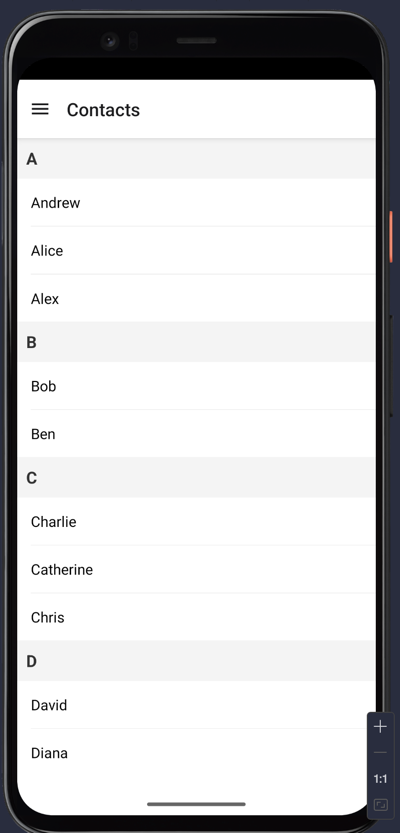
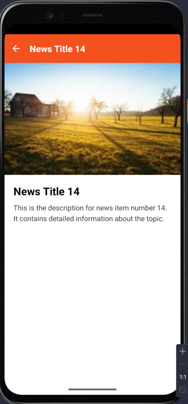

# Лабораторна робота №2: Побудова вкладеної навігації та оптимізація відображення великих списків у React Native із використанням компонентів FlatList та SectionList.

## Інструкція запуску

Для запуску проєкту необхідно виконати наступні кроки:

1. Переконайтеся, що у вас встановлено **Node.js**.
2. Встановіть залежності проєкту:
   ```bash
   npm install
   ```
3. Запустіть Expo сервер:
   ```bash
   npx expo start
   ```
4. Виберіть зручний спосіб перегляду:
   - Відскануйте QR-код за допомогою застосунку **Expo Go** (Android/iOS).
   - Натисніть `a` для запуску в Android-емуляторі.
   - Натисніть `i` для запуску в iOS-симуляторі.

## Опис реалізованого функціоналу

У межах даної роботи було розроблено мобільний застосунок для перегляду новин, який включає:

*   **Списки з віртуалізацією:** Використання компонента `FlatList` для відображення списку новин із високою продуктивністю.
*   **Динамічне завантаження (Pagination):** Реалізовано механізм `onEndReached` для підвантаження нових елементів при досягненні кінця списку.
*   **Оновлення контенту (Pull-to-refresh):** Можливість оновити список новин жестом "свайп вниз".
*   **Складна навігація:** Комбінація `DrawerNavigator` (бокове меню) та `StackNavigator` (перехід між списком та деталями).
*   **Передача параметрів:** Передача об'єкта новини з головного екрана на екран деталей.
*   **Стилізація:** Кастомний контент для Drawer та оформлення карток новин.

## Скріншоти роботи застосунку

<p align="center">
  
  
  
</p>

<p align="center">
  
  
</p>


## Висновки (Відповіді на контрольні запитання)

1.  **Чим відрізняється FlatList від ScrollView?**
    `ScrollView` рендерить усі свої дочірні елементи одночасно, що може призвести до проблем із продуктивністю при великій кількості даних. `FlatList` використовує віртуалізацію: він рендерить лише ті елементи, які зараз видимі на екрані (або знаходяться поруч), що значно економить пам'ять та ресурси процесора.

2.  **Що таке віртуалізація списків?**
    Це техніка оптимізації, яка дозволяє відображати лише частину набору даних. Елементи, що виходять за межі видимості, видаляються з пам'яті (або замінюються порожніми блоками), а нові рендеряться динамічно під час скролу.

3.  **Як здійснюється передача параметрів між екранами?**
    Передача відбувається через другий аргумент функції `navigation.navigate('RouteName', { key: value })`. Отримання даних на цільовому екрані здійснюється через пропс `route.params.key`.

4.  **Що таке вкладена навігація?**
    Це структура, де один навігатор рендериться всередині екрана іншого навігатора. Наприклад, у цьому проєкті `StackNavigator` (для новин) вкладений у `DrawerNavigator`, що дозволяє мати окрему логіку переходів всередині однієї з вкладок меню.

5.  **У яких випадках застосовується SectionList?**
    `SectionList` використовується, коли дані потрібно згрупувати за певним логічним розділом із власним заголовком (наприклад, список контактів, згрупований за першою літерою прізвища, або розклад за днями тижня).
