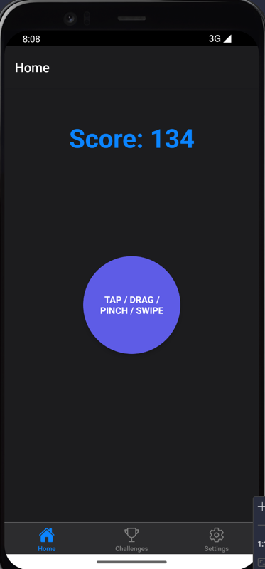
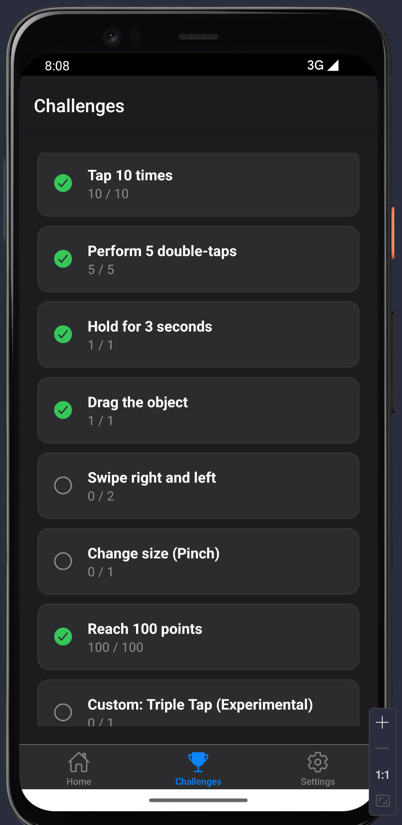
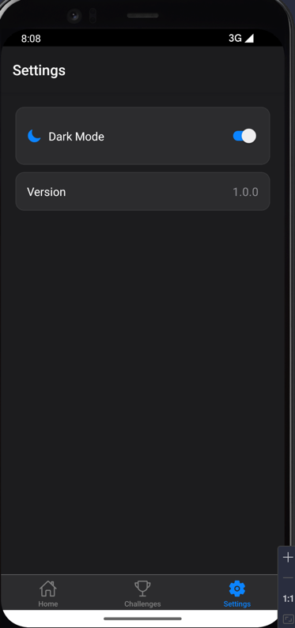
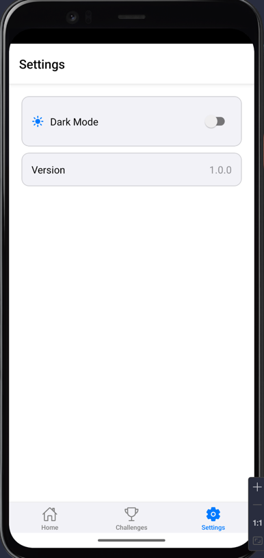
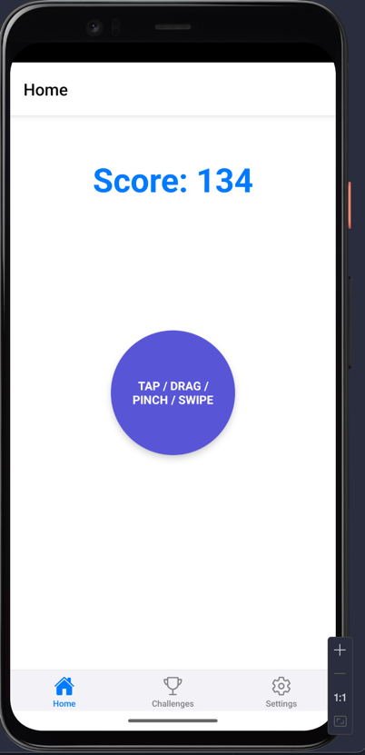

# Лабораторна робота №3: Використання кастомних жестів у React Native та стилізація інтерфейсу мобільного застосунку.

## Мета: 
Навчитися працювати з жестами користувача у мобільному застосунку, реалізувати взаємодію через різні типи жестів та застосувати сучасні підходи стилізації у React Native.

## Інструкція запуску

Для запуску проекту необхідно мати встановлений [Node.js](https://nodejs.org/) та [Expo CLI](https://docs.expo.dev/get-started/installation/).

1. **Клонування репозиторію:**
   ```bash
   git clone <url-вашого-репозиторію>
   cd lab3
   ```

2. **Встановлення залежностей:**
   ```bash
   npm install
   ```

3. **Запуск застосунку:**
   ```bash
   npx expo start
   ```

4. **Використання:**
   - Відскануйте QR-код за допомогою застосунку **Expo Go** на вашому смартфоні (Android/iOS).
   - Або натисніть `a` для запуску на Android-емуляторі чи `i` для iOS-симулятора.

## Реалізований функціонал

### 1. Навігація (React Navigation)
У проекті реалізована нижня панель навігації (**Bottom Tab Navigator**) з трьома основними екранами:
- **Home (Головна):** Центр взаємодії з об'єктом.
- **Challenges (Завдання):** Список досягнень та прогрес їх виконання.
- **Settings (Налаштування):** Керування зовнішнім виглядом застосунку.

### 2. Система жестів (React Native Gesture Handler)
Головний екран містить інтерактивну область, що реагує на наступні жести:
- **Одинарний тап:** Нарахування +1 бала.
- **Подвійний тап:** Нарахування +5 балів.
- **Довге натискання (Long Press):** Нарахування +20 балів.
- **Перетягування (Pan):** Переміщення об'єкта по екрану з поверненням у центр.
- **Свайпи вліво/вправо (Fling):** Нарахування випадкової кількості балів.
- **Щипок (Pinch):** Зміна масштабу (розміру) об'єкта.

### 3. Стан та Контекст (Context API)
- **ScoreContext:** Зберігає поточну кількість балів та стан виконання челенджів. Дані оновлюються в реальному часі на всіх екранах.
- **ThemeContext:** Керує глобальною темою застосунку (світла/темна).

### 4. Стилізація (Styled-components)
Використано бібліотеку `styled-components` для динамічного керування кольорами та стилями залежно від обраної теми.

## Скріншоти роботи застосунку










## Висновки
У ході виконання лабораторної роботи було опановано:
1. Роботу з бібліотекою `react-native-gesture-handler` для обробки складних жестів (тапи, свайпи, перетягування, масштабування).
2. Побудову зручної навігації в мобільному застосунку за допомогою `@react-navigation/bottom-tabs`.
3. Використання `Context API` для ефективного керування глобальним станом (бали, завдання, теми) без "prop drilling".
4. Динамічну стилізацію компонентів за допомогою `styled-components`, що дозволило легко реалізувати підтримку темної та світлої тем.

Проект демонструє сучасні підходи до розробки інтерактивних інтерфейсів на React Native.
