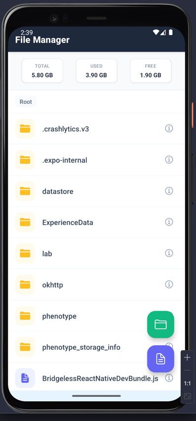
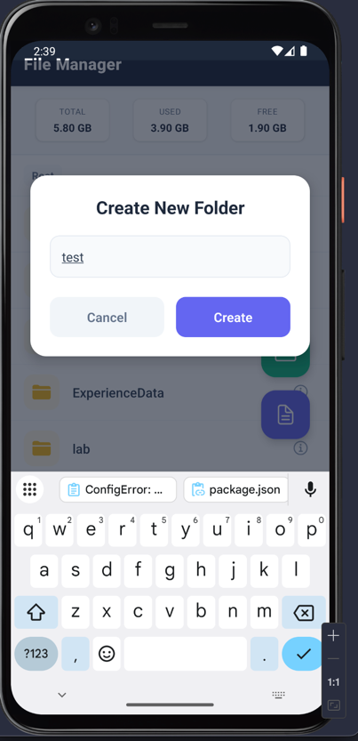
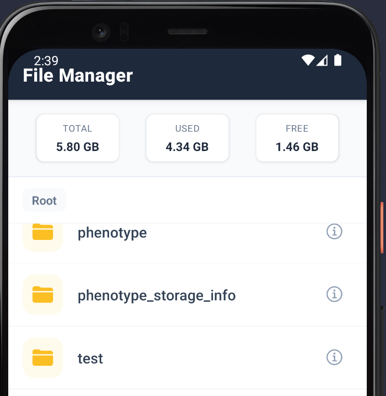
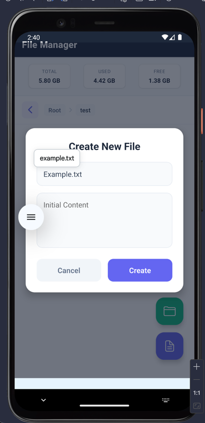
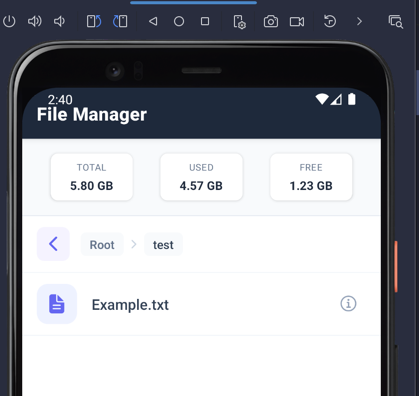
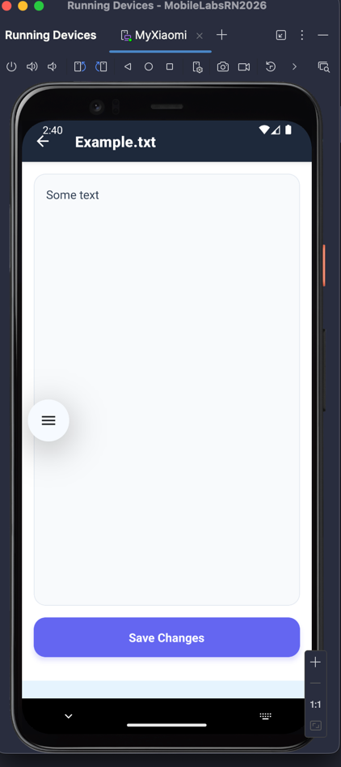
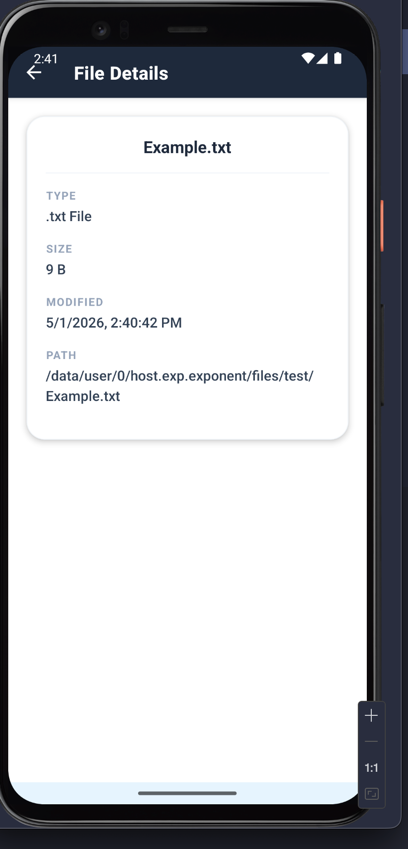
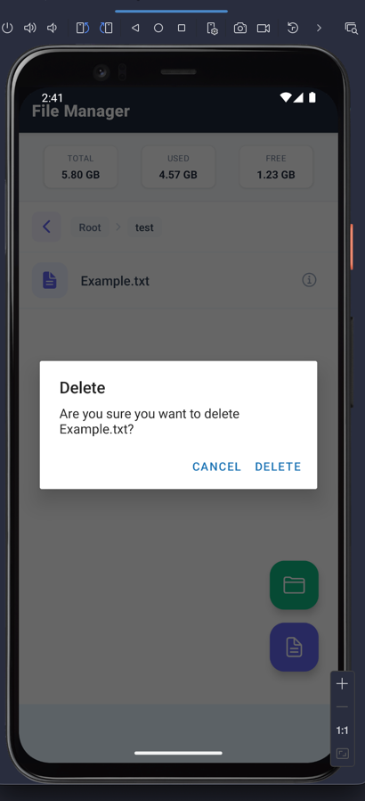
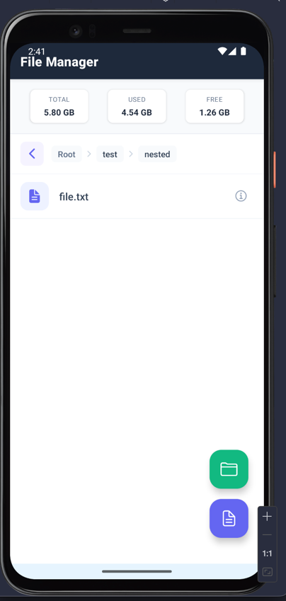

# Лабораторна робота №4
## Виконав студент групи ВТ-22-2 Колесник Олексій

## Тема: Робота з файловою системою в React Native з використанням бібліотеки expo-file-system

## Інструменти

*   React Native (Expo SDK 54)
*   `expo-file-system` - для роботи з файловою системою
*   `@react-navigation/native` & `@react-navigation/native-stack` - для навігації.

## Як запустити

1.  Встановіть залежності:
    ```bash
    npm install
    ```
2.  Запустіть проект:
    ```bash
    npx expo start
    ```

## Реалізований функціонал

```
  Рендеринг елемента списку (файл/папка)
  Відображення шляху та кнопка "Назад"
  Модальне вікно для створення елементів

  Головний екран зі списком та статистикою
  Екран редагування .txt файлів
  Екран детальної інформації
  Навігація
```

## Скріншоти











